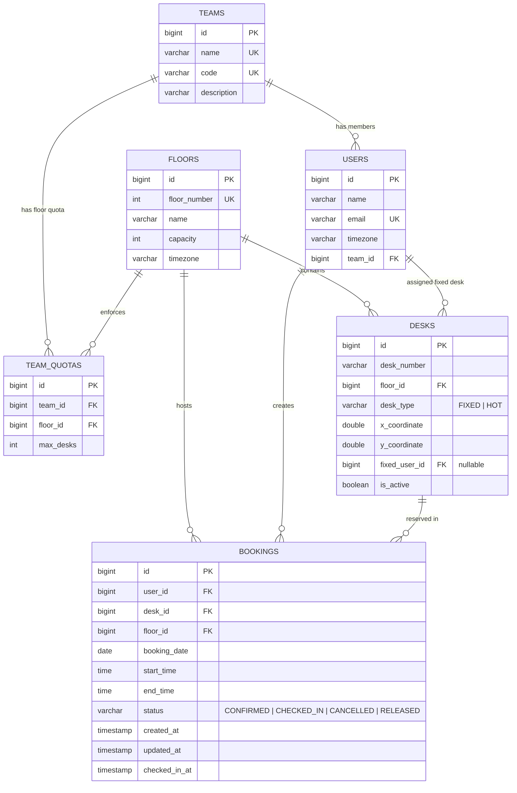

# Smart Desk Booking – Seat Your Team Together

> **LPU Backend Case Study 2026**
> Production-grade, high-concurrency Spring Boot backend for intelligent desk reservations, team neighbourhood placement, quota enforcement, and automated no-show desk release.

---

## Table of Contents
1. [Project Overview](#1-project-overview)
2. [Problem Statement](#2-problem-statement)
3. [Technology Stack](#3-technology-stack)
4. [Architecture](#4-architecture)
5. [Database & ER Diagram](#5-database--er-diagram)
6. [API Endpoints](#6-api-endpoints)
7. [Booking Flow](#7-booking-flow)
8. [Concurrency Strategy](#8-concurrency-strategy)
9. [Rationale Behind Locking & Constraint Selection](#9-rationale-behind-locking--constraint-selection)
10. [Team Neighbourhood Placement Algorithm](#10-team-neighbourhood-placement-algorithm)
11. [Team and Floor Quotas](#11-team-and-floor-quotas)
12. [Check-In & No-Show Release](#12-check-in--no-show-release)
13. [Timezone & Cancellation Cutoff Handling](#13-timezone--cancellation-cutoff-handling)
14. [Time Complexity Analysis](#14-time-complexity-analysis)
15. [Space Complexity Analysis](#15-space-complexity-analysis)
16. [Assumptions](#16-assumptions)
17. [Architectural Trade-offs](#17-architectural-trade-offs)
18. [How to Configure PostgreSQL](#18-how-to-configure-postgresql)
19. [How to Run the Application](#19-how-to-run-the-application)
20. [How to Run Tests](#20-how-to-run-tests)
21. [Sample API Requests & Responses](#21-sample-api-requests--responses)
22. [Concurrency Test Explanation](#22-concurrency-test-explanation)

---

## 1. Project Overview
Smart Desk Booking is a modern backend service built for hybrid workspaces. Employees reserve desks for days they visit the office, automatically seating team members close to one another on a 2D floor grid while strictly preventing double bookings under high concurrency, respecting floor and team quotas, enforcing timezone-aware cancellation cutoffs, and reclaiming empty desks when employees fail to check in.

---

## 2. Problem Statement
In hybrid offices:
- Employees need flexible desk booking for specific dates and time windows.
- Two employees booking the last remaining desk simultaneously must **never result in a double booking**.
- Teammates booking on the same floor should be seated **physically close to each other** without expensive $O(N^2)$ all-pairs comparisons on large 500-desk floors.
- Department/team caps and floor capacity limits must be strictly respected.
- No-show employees waste space; unoccupied desks must be detected and automatically returned to the available pool.

---

## 3. Technology Stack
- **Language**: Java 21 LTS
- **Framework**: Spring Boot 3.3.4 (Spring Web, Spring Data JPA, Spring Validation)
- **Database**: PostgreSQL 17 (production/runtime), H2 (fast isolated testing)
- **ORM / Persistence**: Hibernate 6.5.3
- **API Documentation**: SpringDoc OpenAPI 3.0 / Swagger UI
- **Testing**: JUnit 5, Mockito, Spring Boot Test, MockMvc, Java Concurrency (`ExecutorService`, `CountDownLatch`)
- **Build Tool**: Maven 3.9.x

---

## 4. Architecture
The application follows a clean layered backend architecture:

```text
┌──────────────────────────────────────────────────────────┐
│                   HTTP Clients (cURL / UI)               │
└────────────────────────────┬─────────────────────────────┘
                             │
                             ▼
┌──────────────────────────────────────────────────────────┐
│         REST Controllers (Validation & OpenAPI)          │
│  - BookingController       - FloorController             │
│  - DeskController          - TeamController              │
│  - UserController                                        │
└────────────────────────────┬─────────────────────────────┘
                             │
                             ▼
┌──────────────────────────────────────────────────────────┐
│                     Service Layer                        │
│  - BookingService          - DeskAssignmentService       │
│  - QuotaService            - CheckInService              │
│  - DeskService / FloorService / TeamService / UserService│
│  - NoShowReleaseScheduler (@Scheduled)                   │
└────────────────────────────┬─────────────────────────────┘
                             │
                             ▼
┌──────────────────────────────────────────────────────────┐
│                   Repository Layer                       │
│  - BookingRepository       - DeskRepository              │
│  - FloorRepository         - TeamRepository              │
│  - UserRepository          - TeamQuotaRepository         │
│  (Pessimistic Locking & Spatial Queries)                 │
└────────────────────────────┬─────────────────────────────┘
                             │
                             ▼
┌──────────────────────────────────────────────────────────┐
│                  PostgreSQL Database                     │
│  - Tables: users, teams, floors, desks, bookings, quotas │
│  - Indexes & Constraints: Concurrency & Integrity        │
└──────────────────────────────────────────────────────────┘
```

---

## 5. Database & ER Diagram



---

## 6. API Endpoints

### Booking APIs
| Method | Endpoint | Description |
|---|---|---|
| `POST` | `/api/bookings` | Book a desk (smart auto-assignment or fixed desk) |
| `GET` | `/api/bookings/{bookingId}` | Get booking details by ID |
| `GET` | `/api/bookings/user/{userId}` | Get all bookings for a user |
| `POST` | `/api/bookings/{bookingId}/cancel` | Cancel booking before cutoff |
| `POST` | `/api/bookings/{bookingId}/check-in` | Check in for a confirmed booking |

### Floor & Desk APIs
| Method | Endpoint | Description |
|---|---|---|
| `GET` | `/api/floors` | List all floors |
| `GET` | `/api/floors/{floorId}` | Get floor details |
| `GET` | `/api/floors/{floorId}/desks` | List all desks on floor with optional availability |
| `GET` | `/api/desks/{deskId}` | Get desk details |
| `GET` | `/api/desks/available` | List available desks for floor, date, and time window |

### Team & User APIs
| Method | Endpoint | Description |
|---|---|---|
| `GET` | `/api/teams` | List all teams |
| `GET` | `/api/users/{userId}` | Get user details |

### Swagger UI & OpenAPI Documentation
- Interactive Swagger UI: `http://localhost:8080/swagger-ui.html`
- OpenAPI JSON Spec: `http://localhost:8080/api-docs`

---

## 7. Booking Flow

1. **Validation**: Check that `startTime < endTime`, `bookingDate >= today`, and user/floor exist.
2. **Duplicate Prevention**: Verify user does not already have an active overlapping booking on that date.
3. **Quota Checks**: Validate floor capacity and team quota on that floor.
4. **Desk Selection**:
   - If user has a `FIXED` desk on the floor, select it.
   - If `HOT` desk pool is used, calculate the team centroid of active teammates on that floor and pick the nearest available hot desk.
5. **Pessimistic Lock & Verification**:
   - Acquire a pessimistic write lock on candidate desk row (`SELECT ... FOR UPDATE`).
   - Query overlapping bookings within the transaction.
6. **Commit**: Save booking with `CONFIRMED` status.
7. **Conflict Response**: If another concurrent thread committed first, the losing transaction receives HTTP `409 Conflict`.

---

## 8. Concurrency Strategy
The system prevents double-booking using a **multi-layered concurrency control strategy**:

```text
Concurrent Requests (Thread 1 & Thread 2 for same desk/slot)
                       │
                       ▼
          [ Isolation: READ_COMMITTED ]
                       │
                       ▼
        Desk Lock: SELECT ... FOR UPDATE
                       │
         ┌─────────────┴─────────────┐
         ▼                           ▼
      Thread 1                    Thread 2
   (Acquires Lock)            (Waits on Row Lock)
         │                           │
         ▼                           ▼
 Overlap Check: NONE         Thread 1 Commits
         │                           │
         ▼                           ▼
  Booking Persisted           Thread 2 Wakes Up
         │                           │
         ▼                           ▼
   HTTP 201 CREATED           Overlap Check: FOUND!
                                     │
                                     ▼
                              HTTP 409 CONFLICT
```

### Response for Losing Request
- **HTTP Status Code**: `409 Conflict`
- **Payload**:
```json
{
  "timestamp": "2026-09-23T09:45:00Z",
  "status": 409,
  "error": "Booking Conflict",
  "message": "Desk D-101 was just booked by another employee. Please retry.",
  "path": "/api/bookings"
}
```

---

## 9. Rationale Behind Locking & Constraint Selection
1. **Pessimistic Row Locking (`PESSIMISTIC_WRITE` / `FOR UPDATE`)**:
   - *Why*: In desk reservation systems, contention is short and localized to specific desk rows. Pessimistic locking prevents wasted compute and guarantees serialization without forcing client retry storms.
2. **PostgreSQL Composite Indexing**:
   - Fast lookup on `(desk_id, booking_date, status)` ensures that overlap verification runs in sub-millisecond time.
3. **Database-Level Integrity**:
   - In addition to row locking, any race conditions hitting unique constraints are caught by `GlobalExceptionHandler` and gracefully returned as standard 409 Conflict JSON errors.

---

## 10. Team Neighbourhood Placement Algorithm

### Goal
Seat teammates booking on the same floor close together on the $(x, y)$ coordinate plane.

### Algorithm Design (Optimized for 500-Desk Floors)
1. **Filter Available Desks**: Query all active hot desks on `floorId` excluding desks with overlapping bookings. Resulting set: $D_{\text{avail}}$.
2. **Fetch Active Team Desks**: Retrieve active teammate bookings for the selected floor and time slot.
3. **Centroid Calculation**:
   - If teammates exist, compute the centroid $(\bar{x}, \bar{y})$:
     $$\bar{x} = \frac{1}{K}\sum_{i=1}^{K} x_i, \quad \bar{y} = \frac{1}{K}\sum_{i=1}^{K} y_i$$
   - Calculate Euclidean distance from each candidate desk $d \in D_{\text{avail}}$ to the centroid:
     $$\text{dist}(d) = \sqrt{(d.x - \bar{x})^2 + (d.y - \bar{y})^2}$$
   - Select the candidate desk minimizing $\text{dist}(d)$. Break ties deterministically by coordinates.
4. **No Teammates Booked Yet**: Pick the candidate desk with lowest coordinate indices (or cluster seed).

> **Why this avoids $O(N^2)$ comparisons**: Rather than comparing all pairs of desks $(500 \times 500 = 250,000\text{ checks})$, we compute a single centroid in $O(K)$ time and scan available candidate desks in a single $O(D_{\text{avail}})$ pass!

---

## 11. Team and Floor Quotas
- **Floor Capacity**: Enforces total floor occupancy $\le$ `floor.capacity` (e.g. Floor 3 $\le 60$).
- **Team Quota**: Enforces team floor occupancy $\le$ `teamQuota.maxDesks` (e.g. Team Alpha $\le 8$).
- **Dynamic Reclaim**: When a booking is cancelled or released due to no-show, the quota is immediately released back to the floor/team pool.

---

## 12. Check-In & No-Show Release
- **Check-In Window**: Check-in opens 60 minutes before booking `startTime` and remains open until `startTime + gracePeriodMinutes` (default: 30 minutes).
- **Auto-Release Task**: Spring `@Scheduled` job executes every 30 seconds:
  - Scans for `CONFIRMED` bookings where `now > startTime + gracePeriodMinutes`.
  - Automatically flips status to `RELEASED`.
  - The desk is instantly freed and re-offered to other employees under full quota compliance.

---

## 13. Timezone & Cancellation Cutoff Handling
- **User & Floor Timezones**: Every user and floor possesses an explicit timezone (e.g. `Asia/Kolkata`, `America/New_York`, `UTC`).
- **Cancellation Cutoff**: Must be cancelled at least $C$ hours before start time (default: 2 hours).
- **Exact Boundary Enforcement**:
  - `now < cutoffTime` $\to$ **Allowed (200 OK)**
  - `now >= cutoffTime` $\to$ **Rejected (422 Unprocessable Entity)**

---

## 14. Time Complexity Analysis
- **Floor & Quota Validation**: $O(1)$ database indexed count query.
- **Neighbourhood Placement**:
  - Fetching booked desks: $O(B)$ where $B \le 500$.
  - Centroid calculation: $O(K)$ where $K \le 50$ (teammates).
  - Desk candidate scan: $O(D)$ where $D \le 500$.
  - Total Time: $\mathbf{O(D)}$ where $D \le 500$ desks per floor $\to$ executes in **$< 1\text{ ms}$**.
- **Cancellation & Check-In**: $\mathbf{O(1)}$.

---

## 15. Space Complexity Analysis
- Memory footprint is bounded by candidate desks on a single floor: $\mathbf{O(D_{\text{floor}})}$.
- For 500 desks, memory consumption is a few kilobytes, ensuring extreme scalability.

---

## 16. Assumptions
1. Booking time slots are defined by a date and a time window (`startTime` to `endTime`).
2. Two time intervals $[s_1, e_1)$ and $[s_2, e_2)$ overlap if $s_1 < e_2 \land s_2 < e_1$.
3. Fixed desks are pre-assigned to designated employees; other employees cannot book them. Hot desks belong to the general pool.
4. Distances are computed on a 2D Euclidean coordinate grid.

---

## 17. Architectural Trade-offs
| Decision | Alternative Considered | Rationale |
|---|---|---|
| **Pessimistic Row Locking** | Optimistic Locking (`@Version`) | Optimistic locking causes high retry overhead under hot contention; pessimistic row locking cleanly serializes access. |
| **Team Centroid Clustering** | All-Pairs Minimum Distance ($O(N \cdot K)$) | Centroid calculation is $O(D)$, eliminating quadratic complexity while maintaining high clustering quality. |
| **Layered Monolith** | Microservices Architecture | A single deployable service eliminates network latency and distributed transaction complexity, perfectly satisfying case-study scope. |

---

## 18. How to Configure PostgreSQL

1. Ensure PostgreSQL is running on `localhost:5432`.
2. Connect using `psql`:
   ```bash
   psql -U postgres -h 127.0.0.1
   ```
3. Create the database:
   ```sql
   CREATE DATABASE smartdesk_db;
   ```
4. Verify `src/main/resources/application.properties`:
   ```properties
   spring.datasource.url=jdbc:postgresql://localhost:5432/smartdesk_db
   spring.datasource.username=postgres
   spring.datasource.password=1234
   ```

---

## 19. How to Run the Application

Build and run using Maven:
```powershell
mvn spring-boot:run
```
Or build the JAR and run:
```powershell
mvn clean package -DskipTests
java -jar target/smart-desk-booking-1.0.0.jar
```
The server will start on port `8080`.

---

## 20. How to Run Tests

Execute all unit, integration, and concurrency test suites:
```powershell
mvn clean test
```

### Included Test Classes:
1. `ConcurrentBookingTest`: Multi-threaded simultaneous booking collision test (1 winner, 1 loser) + 10-thread contention test.
2. `NeighbourhoodPlacementTest`: Team clustering test + 500-desk floor grid performance benchmark.
3. `QuotaValidationTest`: Floor capacity and team quota rejection & recovery tests.
4. `CancellationCutoffTest`: Exact boundary cutoff deadline verification.
5. `CheckInAndNoShowTest`: Check-in window validation & scheduled auto-release.
6. `FixedVsHotDeskTest`: Fixed desk reservation vs hot desk pool test.
7. `TimezoneBookingTest`: Cross-timezone boundary calculation tests.
8. `BookingControllerIntegrationTest`: Full REST API HTTP MockMvc tests.

---

## 21. Sample API Requests & Responses

### 1. Create a Booking (Smart Neighbourhood Auto-Assignment)
**Request**:
```bash
curl -X POST http://localhost:8080/api/bookings \
  -H "Content-Type: application/json" \
  -d '{
    "userId": 2,
    "floorId": 3,
    "bookingDate": "2026-10-01",
    "startTime": "09:00",
    "endTime": "17:00"
  }'
```
**Response (`201 Created`)**:
```json
{
  "bookingId": 1,
  "userId": 2,
  "userName": "Bob Jones",
  "teamId": 1,
  "teamName": "Team Alpha",
  "deskId": 2,
  "deskNumber": "D-301",
  "deskType": "HOT",
  "deskX": 10.0,
  "deskY": 10.0,
  "floorId": 3,
  "floorNumber": 3,
  "floorName": "Level 3 Smart Team Floor",
  "bookingDate": "2026-10-01",
  "startTime": "09:00:00",
  "endTime": "17:00:00",
  "status": "CONFIRMED",
  "createdAt": "2026-09-23T09:45:42Z",
  "message": "Desk D-301 booked successfully on Floor 3."
}
```

### 2. Teammate Booking (Auto-clustered adjacent to Bob)
**Request**:
```bash
curl -X POST http://localhost:8080/api/bookings \
  -H "Content-Type: application/json" \
  -d '{
    "userId": 3,
    "floorId": 3,
    "bookingDate": "2026-10-01",
    "startTime": "09:00",
    "endTime": "17:00"
  }'
```
**Response (`201 Created`)**:
```json
{
  "bookingId": 2,
  "userId": 3,
  "userName": "Charlie Brown",
  "teamId": 1,
  "teamName": "Team Alpha",
  "deskId": 3,
  "deskNumber": "D-302",
  "deskType": "HOT",
  "deskX": 11.0,
  "deskY": 10.0,
  "floorId": 3,
  "floorNumber": 3,
  "floorName": "Level 3 Smart Team Floor",
  "status": "CONFIRMED",
  "message": "Desk D-302 booked successfully on Floor 3."
}
```

### 3. Check-In
**Request**:
```bash
curl -X POST http://localhost:8080/api/bookings/1/check-in
```
**Response (`200 OK`)**:
```json
{
  "bookingId": 1,
  "status": "CHECKED_IN",
  "checkedInAt": "2026-09-23T09:46:00Z",
  "message": "Check-in successful. Enjoy your desk!"
}
```

### 4. Cancel a Booking
**Request**:
```bash
curl -X POST "http://localhost:8080/api/bookings/2/cancel?userId=3"
```
**Response (`200 OK`)**:
```json
{
  "bookingId": 2,
  "status": "CANCELLED",
  "message": "Booking cancelled successfully. Desk returned to pool."
}
```

---

## 22. Concurrency Test Explanation
The mandatory concurrency test (`ConcurrentBookingTest.java`) simulates two threads firing simultaneous requests against the single remaining desk on a floor:
- A `CountDownLatch(1)` synchronizes thread start to guarantee simultaneous execution.
- A `CountDownLatch(2)` waits for completion.
- Results verified:
  - Exactly **1 thread succeeds (`successCount == 1`)**.
  - Exactly **1 thread receives `409 Conflict` (`conflictCount == 1`)**.
  - Database contains **exactly 1 active booking**.
 
## Demo Images
1. Concurrency issue (Overlapping booking)


2. Test Invalid Time


3. Test Invalid Employee/User
   

4. Test Cancellation


